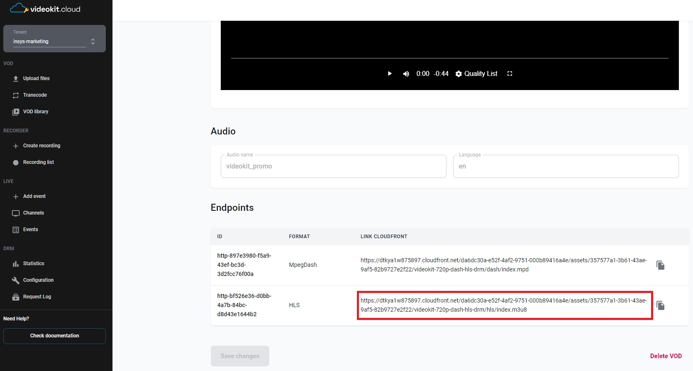
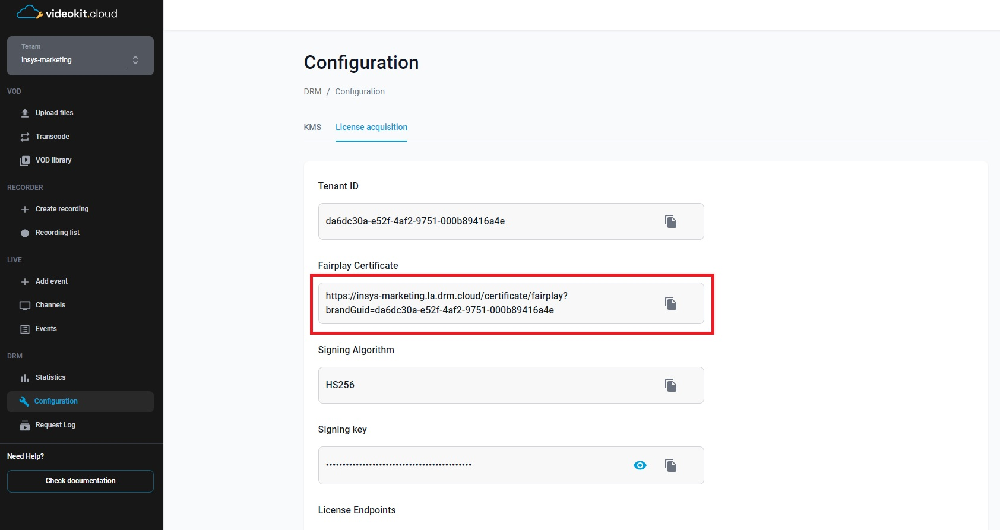
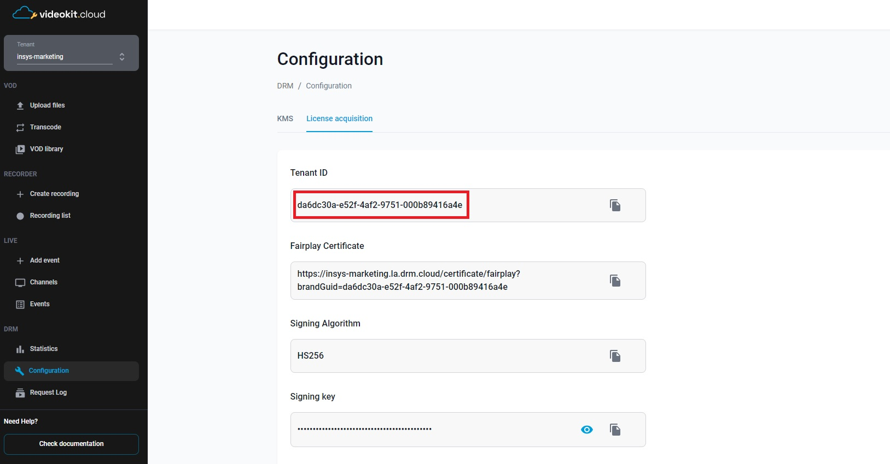

# Bitmovin Player with Cloud DRM in Swift

That sets up and displays a video player using the BitmovinPlayer framework. 
Here's a detailed description of what the code does:

## Prerequisites

  - XCode installed
  - Knowledge of Swift programming language
  - Obtain the Bitmovin Player SDK and license key from the Bitmovin dashboard (https://dashboard.bitmovin.com/player/licenses) and follow their instructions for integration.
  - Access to Cloud DRM (via Cloud Video Kit web console) to obtain: 
    - `videoUrl` - The url to the HLS manifest of the video
     

    - `certificateUrl` - Certificate server url
    
    
    - `x-drm-brandGuid` - Tenant ID in the Cloud Video Kit
    

    - `x-drm-userToken` - A token that allows you to issue a license to play drm material. <br>[More information about the structure of the token and how to generate it can be found here](https://developers.drm.cloud/licence-acquisition/licence-acquisition)
    ```json
    {
      "exp": 1893456000, 
      "drmTokenInfo": {
        "exp": "2030-01-01T00:00:00+00:00", 
        "kid": ["c7962562-1517-44c2-8937-a1f2c6b849fc"], 
        "p": { 
          "pers": false 
        }
      }
    }
    ```

## Bitmovin configuration

1. Obtain the Bitmovin Player SDK and license key from the Bitmovin website (https://bitmovin.com) and follow their instructions for integration.
2. Allow-list your package names for your player license: Log in to [https://bitmovin.com/dashboard](https://bitmovin.com/dashboard), navigate to `Player -> Licenses`, and add the following package names of the sample applications as allowed domains:
   - `com.insys.player.bitmovin.drm.swiftui.drmplaybackswiftui` (for SwiftUI)
   - `com.insys.player.bitmovin.drm.uikit.drmplaybackuikit` (for UIKit)
  This step ensures that your license key is valid for your specific package names.
3. You can add your Bitmovin player license key to the `Info.plist` file as `BitmovinPlayerLicenseKey`. Another option is to set the license key by using the PlayerConfig.key property when creating a Player instance.

## Getting Started

1. The ContentView struct conforms to the View protocol in SwiftUI, indicating that it represents a view in the app's user interface.
2. Inside ContentView, we have the following properties:
   - `player`: Player represents the video player object.
   - `playerViewConfig`: PlayerViewConfig holds the configuration settings for the player's view.
3. The sourceConfig property is a computed property of type `SourceConfig`.
    1. At the beginning of the code block, two URL variables are defined. The first one, `videoUrl`, represents the URL of the video to be played. The second variable, `certificateUrl`, holds the URL of the FairPlay Streaming certificate.
    2. Then, a check is performed to ensure that the values of `videoUrl` and `certificateUrl` are valid. If either of these values is not provided (i.e., they are empty), the application will be halted, and an error will be displayed.
    3. Next, the configuration objects for the `FairPlay` player are created. A `FairplayConfig` object named fpsConfig is instantiated, representing the FairPlay Streaming configuration.
    4. The prepareMessage block within the fpsConfig object contains a function that is called to prepare the `Server Playback Context (SPC)` data. In this case, the function returns the original SPC data without any modifications.
    5. The prepareCertificate block within the fpsConfig object contains a function that is called to prepare the certificate data. In this example, the function returns the original certificate data without any modifications.
    6. Then, the license request headers are set in the fpsConfig.licenseRequestHeaders dictionary. In this case, two values are set: `x-drm-brandGuid` and `x-drm-usertoken`. These headers are required to pass information about the `brandGuid` and `userToken` during the DRM license request.
    7. Finally, a `SourceConfig` object is created. This object represents the configuration for the video source. It includes the video URL, the type of video (in this case, `.hls`), and the DRM configuration (fpsConfig) for FairPlay Streaming.
4. Inside the `init()` method of the ContentView class, the video player configuration and the player view configuration are initialized. Here's a more detailed explanation of what happens inside this method: 
    1. A `PlayerConfig` object named playerConfig is created. `PlayerConfig` is responsible for configuring the video player.
    2. Then, the `create(playerConfig:)` method is called on the `PlayerFactory` class, passing the playerConfig object as an argument. This method creates an instance of the video player based on the provided configuration and assigns it to the player variable in the ContentView class.
    3. Next, the playerViewConfig variable of type `PlayerViewConfig` is initialized. This configuration holds the settings related to the appearance and behavior of the video player view.
5. The body property defines the structure of the view. It consists of a VStack that contains a ZStack. The ZStack is used to layer the video player view on top of a black background color represented by the Color.black. The actual video player view is created using the SwiftUIPlayerView and configured with the player and playerViewConfig properties.
6. The onAppear modifier is applied to the VStack and specifies an action to be performed when the view appears. In this case, it loads the sourceConfig into the player using the `player.load(sourceConfig:)` method. This action ensures that the video specified in the sourceConfig is loaded and ready to be played when the view appears.

## License

This project is licensed under the [MIT License](LICENSE).

## Acknowledgements

- Bitmovin Player: https://bitmovin.com/player
- Bitmovin Documentation: https://bitmovin.com/docs/player